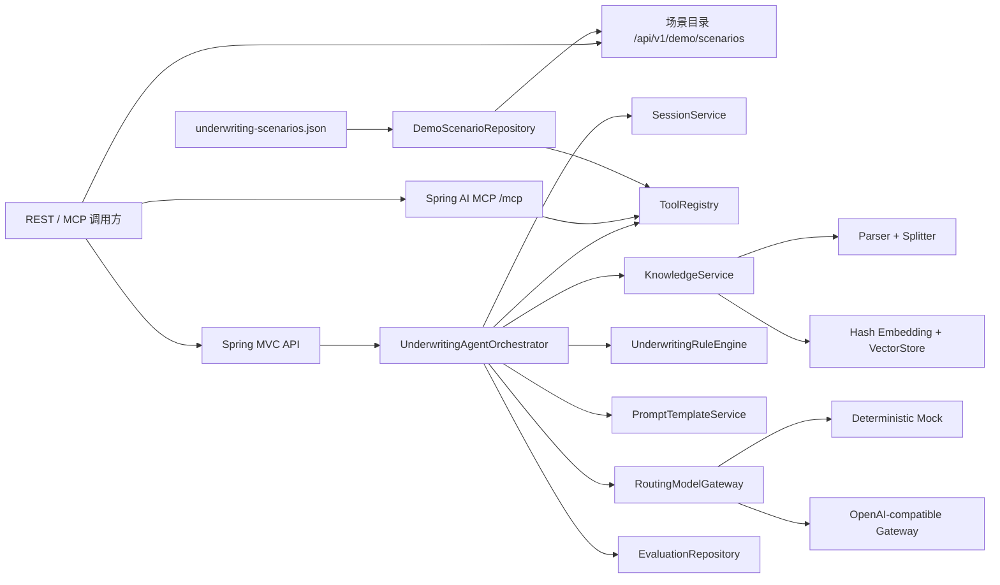

# 架构与关键设计

## 1. 目标与边界

这个 Demo 解决的不是“让模型替核保人拍板”，而是把分散资料聚合、知识查找、规则检查和建议生成串成可审计的辅助决策闭环。确定性规则拥有最终决策下限；模型负责组织语言和给出后续动作。

所有业务数据、条款和地址均为虚构。默认实现强调本地可运行和面试可解释，不声称具备生产级语义召回效果。

## 2. 组件关系



## 3. 结构化虚构场景

`src/main/resources/demo/underwriting-scenarios.json` 是演示业务事实的唯一来源。`DemoScenarioRepository` 在应用启动时加载四组场景，检查重复保单号、子对象保单号、负金额、日期范围、预期风险分和重复规则代码。无效数据会阻止应用启动，不会静默回退。

`FakeUnderwritingFactTools` 从仓库读取保单、报价、历史核保、查勘和灾害风险五类事实，REST 与 MCP 工具继续复用相同实现。只读场景接口 `/api/v1/demo/scenarios` 也读取同一仓库，但只承担教学展示，不创建会话或触发核保流程。

## 4. 七步 Agent 流程

| 顺序 | 步骤 | 主要动作 | 失败策略 |
|---|---|---|---|
| 1 | `QUESTION_UNDERSTANDING` | 创建/恢复会话，写入用户问题 | 会话不存在则终止 |
| 2 | `BUSINESS_DATA_COLLECTION` | 调用保单、报价、历史、查勘、灾害五个工具 | 关键资料失败则终止，并记录失败轨迹 |
| 3 | `KNOWLEDGE_RETRIEVAL` | 问题 + 标的用途 + 灾害等级组合检索 | 空证据不终止，但提高决策下限 |
| 4 | `RISK_ANALYSIS` | 汇总强类型 `UnderwritingContext` | 类型/数据不完整则终止 |
| 5 | `RULE_VALIDATION` | 执行五条确定性规则 | 规则结论成为模型不可降低的下限 |
| 6 | `RECOMMENDATION_GENERATION` | 渲染 Prompt 并调用路由模型 | 按配置重试/显式降级，否则返回 503 |
| 7 | `RESULT_PERSISTENCE` | 保存评估并追加助手消息 | 失败轨迹保留并传播异常 |

`runStep` 统一测量耗时并写入 `StepTrace`。`ToolRegistry` 同样为每个工具写入脱敏 `ToolCallTrace`，因此可以区分“流程慢”还是“某个内部系统慢”。

## 5. RAG 流程

```text
Markdown/Text
  -> 清理与解析
  -> 段落优先切分
  -> 固定最大窗口 + 重叠
  -> Hash Embedding（固定维度、L2 归一化）
  -> 内存向量库
  -> 余弦相似度 Top-K + 文档类型/险种过滤
```

Hash Embedding 的优点是无需模型、完全确定、测试稳定；缺点是语义能力有限。生产环境保持 `EmbeddingService` 与 `VectorStore` 端口不变，替换为企业 Embedding + PGVector/Milvus 即可。

## 6. 规则优先于模型

五条默认规则分别覆盖红色暴雨、重复出险、高保额、整改未完成和极端火灾叠加重大消防缺陷。风险分从 10 分起算，累加命中影响并限制在 0–100：

- 0–29：`LOW`
- 30–59：`MEDIUM`
- 60–79：`HIGH`
- 80–100：`CRITICAL`

决策强度为 `APPROVE < MANUAL_REVIEW < REJECT`。编排器只从规则结果计算最终决策，模型响应没有修改决策的字段。知识证据为空时额外施加 `MANUAL_REVIEW` 下限。

## 7. 模型网关

`ModelGateway` 是唯一模型端口：

- `DeterministicMockModelGateway`：稳定生成中文摘要，适合离线演示和回归测试。
- `OpenAiCompatibleModelGateway`：调用 `/v1/chat/completions`，设置连接/读取超时，限定尝试次数。
- `RoutingModelGateway`：按配置选择主模型；只在显式允许时回退 Mock。

429、5xx、网络 I/O 和超时可以重试，普通 4xx 立即失败。线程中断会被恢复。密钥不进入 `toString`、异常、日志或响应。

## 8. REST 与 MCP 共用业务逻辑

REST 的 `/api/v1/tools` 和 MCP 的六个 `@McpTool` 都委托给 `ToolRegistry` 与 `UnderwritingRuleEngine`，没有复制内部系统查询规则。这样工具定义、审计和错误语义保持一致。

MCP 使用 Spring AI WebMVC Server 的 Streamable HTTP 传输，默认地址 `/mcp`。六个工具都有强类型参数与输出 Schema，适合作为另一个 Agent 或大模型客户端的工具服务器。

## 9. 一致性、并发与演进

Demo 仓库使用 `ConcurrentHashMap`、不可变 record 和复制后返回，避免最明显的并发修改问题。真正生产化还需要：

- 会话版本号、幂等请求号和数据库事务；
- 分布式锁或工作流实例级串行；
- 异步任务、超时取消、补偿与死信队列；
- RAG 文档状态机（草稿、审核、发布、下线）和索引版本；
- 租户隔离、RBAC、脱敏、全链路审计和数据留存策略；
- Prompt/模型灰度、离线评测集、召回指标和人工反馈闭环。

## 10. 主要扩展点

| 接口 | 当前实现 | 可替换实现 |
|---|---|---|
| `SessionRepository` | 内存 | Redis / PostgreSQL |
| `EvaluationRepository` | 内存 | PostgreSQL / 审计仓库 |
| `EmbeddingService` | Hash | 企业 Embedding API |
| `VectorStore` | 内存 | PGVector / Milvus |
| `UnderwritingFactTools` | JSON 场景仓库 | 内部 REST/gRPC/MQ 适配器 |
| `ModelGateway` | Mock / OpenAI-compatible | 企业模型平台 SDK |
