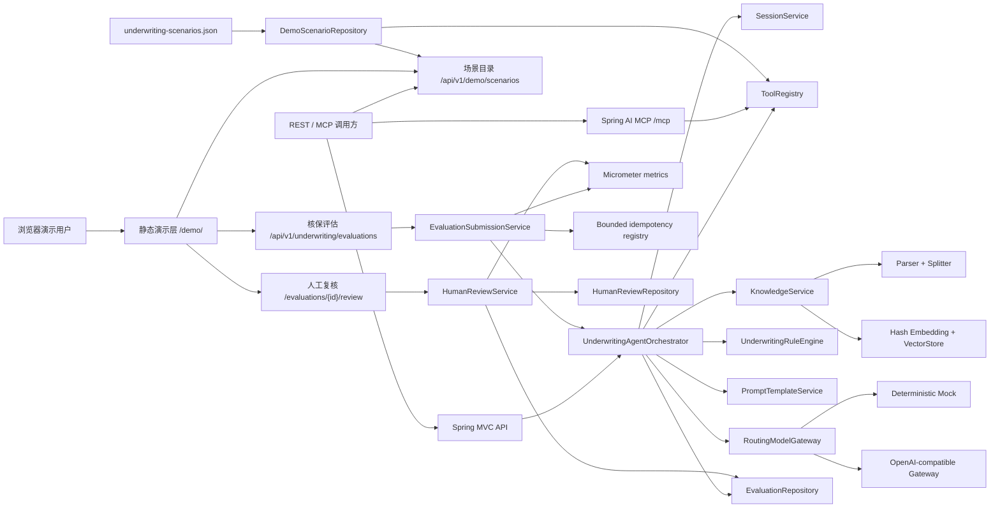

# 架构与关键设计

## 1. 目标与边界

这个 Demo 解决的不是“让模型替核保人拍板”，而是把分散资料聚合、知识查找、规则检查和建议生成串成可审计的辅助决策闭环。确定性规则拥有最终决策下限；模型负责组织语言和给出后续动作。

所有业务数据、条款和地址均为虚构。默认实现强调本地可运行和面试可解释，不声称具备生产级语义召回效果。

## 2. 组件关系



### 静态演示层

`/demo/` 由 Spring Boot 直接提供 HTML、原生 JavaScript 和 CSS，不需要 Node.js、外部字体或前端构建。页面先调用 `/api/v1/demo/scenarios` 读取四组虚构场景，用户点击“运行智能核保”后再调用 `/api/v1/underwriting/evaluations`。动态接口内容统一通过安全 DOM API 写入页面，不作为 HTML 字符串执行。

静态演示层只负责把业务事实、结论、规则命中、知识证据和轨迹翻译成更容易理解的中文界面，不复制核保逻辑。场景事实仍来自 `DemoScenarioRepository`，Agent 建议仍由真实七步流程、规则引擎和模型网关共同生成；人工复核表单调用独立 Review API，不在浏览器内修改评估结果。

## 3. 结构化虚构场景

`src/main/resources/demo/underwriting-scenarios.json` 是演示业务事实的唯一来源。`DemoScenarioRepository` 在应用启动时加载四组场景，检查重复保单号、子对象保单号、负金额、日期范围、预期风险分和重复规则代码。无效数据会阻止应用启动，不会静默回退。

`FakeUnderwritingFactTools` 从仓库读取保单、报价、历史核保、查勘和灾害风险五类事实，REST 与 MCP 工具继续复用相同实现。只读场景接口 `/api/v1/demo/scenarios` 也读取同一仓库，但只承担教学展示，不创建会话或触发核保流程。

## 4. 七步 Agent 流程

| 顺序 | 步骤 | 主要动作 | 失败策略 |
|---|---|---|---|
| 1 | `QUESTION_UNDERSTANDING` | 创建/恢复会话，写入用户问题 | 会话不存在则终止 |
| 2 | `BUSINESS_DATA_COLLECTION` | 调用保单、报价、历史、查勘、灾害五个工具 | 关键资料失败则终止；灾害数据源失败可安全降级并标记 `DEGRADED` |
| 3 | `KNOWLEDGE_RETRIEVAL` | 问题 + 标的用途 + 灾害等级组合检索 | 空证据不终止，但提高决策下限 |
| 4 | `RISK_ANALYSIS` | 汇总强类型 `UnderwritingContext` | 类型/数据不完整则终止 |
| 5 | `RULE_VALIDATION` | 执行五条确定性规则 | 规则结论成为模型不可降低的下限 |
| 6 | `RECOMMENDATION_GENERATION` | 渲染 Prompt 并调用路由模型 | 按配置重试/显式降级，否则返回 503 |
| 7 | `RESULT_PERSISTENCE` | 保存评估并追加助手消息 | 失败轨迹保留并传播异常 |

`runStep` 统一测量耗时并写入 `StepTrace`。`ToolRegistry` 同样为每个工具写入脱敏 `ToolCallTrace`，因此可以区分“流程慢”还是“某个内部系统慢”。

## 5. RAG 流程

```text
Markdown/Text
  -> 清理与解析
  -> 段落优先切分
  -> 固定最大窗口 + 重叠
  -> Hash Embedding（固定维度、L2 归一化）
  -> 内存向量库
  -> 余弦相似度 Top-K + 文档类型/险种过滤
```

Hash Embedding 的优点是无需模型、完全确定、测试稳定；缺点是语义能力有限。生产环境保持 `EmbeddingService` 与 `VectorStore` 端口不变，替换为企业 Embedding + PGVector/Milvus 即可。

## 6. 规则优先于模型

五条默认规则分别覆盖红色暴雨、重复出险、高保额、整改未完成和极端火灾叠加重大消防缺陷。风险分从 10 分起算，累加命中影响并限制在 0–100：

- 0–29：`LOW`
- 30–59：`MEDIUM`
- 60–79：`HIGH`
- 80–100：`CRITICAL`

决策强度为 `APPROVE < MANUAL_REVIEW < REJECT`。编排器只从规则结果计算最终决策，模型响应没有修改决策的字段。知识证据为空时额外施加 `MANUAL_REVIEW` 下限。

## 7. 模型网关

`ModelGateway` 是唯一模型端口：

- `DeterministicMockModelGateway`：稳定生成中文摘要，适合离线演示和回归测试。
- `OpenAiCompatibleModelGateway`：调用 `/v1/chat/completions`，设置连接/读取超时，限定尝试次数。
- `RoutingModelGateway`：按配置选择主模型；只在显式允许时回退 Mock。

429、5xx、网络 I/O 和超时可以重试，普通 4xx 立即失败。线程中断会被恢复。密钥不进入 `toString`、异常、日志或响应。

## 8. REST 与 MCP 共用业务逻辑

REST 的 `/api/v1/tools` 和 MCP 的六个 `@McpTool` 都委托给 `ToolRegistry` 与 `UnderwritingRuleEngine`，没有复制内部系统查询规则。这样工具定义、审计和错误语义保持一致。

MCP 使用 Spring AI WebMVC Server 的 Streamable HTTP 传输，默认地址 `/mcp`。六个工具都有强类型参数与输出 Schema，适合作为另一个 Agent 或大模型客户端的工具服务器。

### 8.1 分级工具失败与安全降级

`ToolName` 通过 `ToolCriticality` 显式声明 `CRITICAL` 或 `DEGRADABLE`。`ToolRegistry` 提供两种语义但复用同一套计时、
错误码和脱敏轨迹：

- `invoke` 是严格调用，失败时原样传播异常，适用于保单、报价、历史、查勘和规则校验；
- `tryInvoke` 返回 `ToolAttempt`，同时携带结果或失败以及对应轨迹，供编排器执行明确的降级策略；
- 全局调试轨迹使用有界队列，仅保留最近 1,000 条，避免长期运行无限增长。

灾害平台是当前唯一 `DEGRADABLE` 工具。失败后系统构造 `HazardLevel.UNKNOWN` 占位，不会用
`LOW` 冒充未知；业务资料采集步骤标记为 `DEGRADED`，结果写入 `DegradationNotice`，决策下限
提升到 `MANUAL_REVIEW`。原始规则分和风险等级继续保留，因此调用方能区分“基础风险低”和
“资料不完整所以不能自动承保”。关键工具仍失败即终止，不允许普遍吞错。

`degraded-demo` Profile 只为 `P-2001` 注入灾害平台超时，用于可重复演示和集成测试；默认 Profile
不包含故障注入。生产适配器还应把超时、限流、无数据、权限失败和程序缺陷分类，只有允许的故障
类型才能进入降级路径。

## 9. 幂等、并发与指标

`POST /api/v1/underwriting/evaluations` 可选接收 `Idempotency-Key`。提交服务对规范化后的
`sessionId + policyNo + question` 计算 SHA-256 指纹，并用一个短临界区原子认领键：

- 首个请求成为 owner，执行一次七步 Agent；
- 同键、同指纹的并发请求等待同一个 `CompletableFuture`，完成后直接重放同一评估；
- 同键、不同指纹立即返回 `409 IDEMPOTENCY_KEY_CONFLICT`；
- 执行失败会完成异常并删除槽位，原键可以安全重试；
- 只淘汰已完成槽位，绝不淘汰进行中的 owner，避免容量回收制造重复执行。

这是单实例 Demo 实现。缓存通过最大条数和完成后保留期限制内存，默认 1,000 条、24 小时。
多实例生产环境应把同一状态机迁移到 Redis 或带唯一约束的数据库，并保存最终响应或评估编号。

评估提交服务写入四组低基数 Micrometer 指标：

| 指标 | 标签 | 含义 |
|---|---|---|
| `underwriting.evaluation.submissions` | `outcome` | `created`、`replayed`、`conflict`、`failed` 提交数 |
| `underwriting.evaluation.duration` | `outcome` | 包含并发等待时间的 API 提交耗时 |
| `underwriting.evaluation.decisions` | `decision`、`risk_level` | 实际执行生成的结论分布，不重复统计重放请求 |
| `underwriting.agent.degradations` | `tool`、`reason` | 实际执行发生的安全降级；重放请求不重复统计 |

`/actuator/metrics/{metricName}` 可直接检查本机指标。生产环境再接 Prometheus Registry 和告警系统。

## 10. 人工复核反馈闭环

`POST /api/v1/underwriting/evaluations/{evaluationId}/review` 在 Agent 评估之外创建一条不可变
`HumanReview`。它不会覆盖 `UnderwritingEvaluation.decision`，因此报告可以同时展示“Agent 辅助建议”
和“人工处理结论”，审计时不会丢失模型与规则当时给出的原始判断。

`HumanReviewRepository.create` 使用 `putIfAbsent` 原子保证一份评估最多只有一条当前演示结论；第二次
提交返回 `409 HUMAN_REVIEW_ALREADY_EXISTS`。关系分类不交给前端或模型，而是由服务端确定性计算：

| Agent 建议与人工结果 | `relationship` | 含义 |
|---|---|---|
| 自动通过/拒保与人工结果一致 | `CONFIRMED` | 人工确认 Agent 建议 |
| 自动通过/拒保被人工改变 | `OVERRIDDEN` | 人工推翻 Agent 建议 |
| 人工复核最终变为承保或拒保 | `RESOLVED_MANUAL_REVIEW` | 人工完成处置 |
| 人工复核仍需更多资料 | `CONTINUED_MANUAL_REVIEW` | 继续停留在人工环节 |

复核服务额外暴露两组低基数指标：

| 指标 | 标签 | 含义 |
|---|---|---|
| `underwriting.human.reviews` | `outcome`、`relationship` | 人工结论与采纳/推翻关系分布 |
| `underwriting.human.review.delay` | `outcome`、`relationship` | 从 Agent 评估完成到人工复核的时延 |

标签不包含人员编号、评估编号或保单号。`GET /api/v1/underwriting/reviews` 可作为本地反馈导出入口；
生产环境必须增加机构权限、脱敏、用途审批和数据留存控制，不能直接把原始业务记录送去训练模型。

## 11. 一致性与生产演进

Demo 仓库使用 `ConcurrentHashMap`、不可变 record、复制后返回和单实例幂等单飞，避免最明显的并发修改与重复提交问题。真正生产化还需要：

- 会话版本号、跨节点幂等记录和数据库事务；
- 分布式锁或工作流实例级串行；
- 异步任务、超时取消、补偿与死信队列；
- RAG 文档状态机（草稿、审核、发布、下线）和索引版本；
- 租户隔离、RBAC、脱敏、全链路审计和数据留存策略；
- Prompt/模型灰度、离线评测集、召回指标和经过审批的脱敏反馈样本集。

## 12. 主要扩展点

| 接口 | 当前实现 | 可替换实现 |
|---|---|---|
| `SessionRepository` | 内存 | Redis / PostgreSQL |
| `EvaluationRepository` | 内存 | PostgreSQL / 审计仓库 |
| `HumanReviewRepository` | 内存、单评估原子创建 | PostgreSQL 追加事件 / 工作流任务库 |
| `EmbeddingService` | Hash | 企业 Embedding API |
| `VectorStore` | 内存 | PGVector / Milvus |
| `UnderwritingFactTools` | JSON 场景仓库 | 内部 REST/gRPC/MQ 适配器 |
| `ModelGateway` | Mock / OpenAI-compatible | 企业模型平台 SDK |
