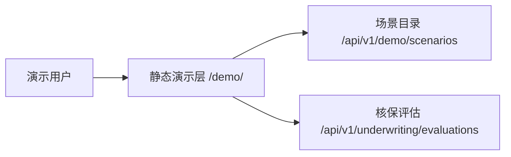

# 中文交互核保演示台 Implementation Plan

> **For agentic workers:** REQUIRED SUB-SKILL: Use superpowers:subagent-driven-development (recommended) or superpowers:executing-plans to implement this plan task-by-task. Steps use checkbox (`- [ ]`) syntax for tracking.

**Goal:** 为现有 Spring Boot 核保 Agent 增加一个无需前端构建、可直接选择四组假数据并运行真实核保流程的中文浏览器演示台。

**Architecture:** 使用 Spring MVC 视图路由把 `/demo` 规范化到 `/demo/`，再转发到 Spring Boot 原生静态资源。原生 JavaScript 读取现有场景目录和核保评估接口，用安全 DOM API 展示事实、结论、规则、证据和轨迹；CSS 独立负责响应式布局和可访问状态，不新增业务接口或外部依赖。

**Tech Stack:** Java 21、Spring Boot 4.1、Spring MVC、JUnit 5、MockMvc、HTML5、原生 JavaScript、CSS3、Maven

---

## 文件结构与职责

**新增文件：**

- `src/main/java/com/hrniux/underwriting/demo/DemoConsoleWebConfiguration.java`：规范化 `/demo` 路径并把 `/demo/` 转发到静态首页。
- `src/main/resources/static/demo/index.html`：中文演示台的语义化页面骨架和可访问动态区域。
- `src/main/resources/static/demo/app.js`：场景加载、请求竞态控制、核保调用、中文枚举映射和安全 DOM 渲染。
- `src/main/resources/static/demo/styles.css`：无外部依赖的业务视觉、响应式布局、焦点与状态样式。
- `src/test/java/com/hrniux/underwriting/demo/DemoConsoleStaticResourceTest.java`：演示入口、静态资源、客户端接口约定和安全渲染契约。

**修改文件：**

- `src/test/java/com/hrniux/underwriting/docs/DocumentationContractTest.java`：把演示台入口和静态交付物加入文档契约。
- `README.md`：增加浏览器入口和三步最短体验路径。
- `docs/DEMO_DATA_GUIDE.md`：增加交互演示台教学流程，保留 API 路径供技术讲解。
- `docs/ARCHITECTURE.md`：补充浏览器展示层与现有接口的调用关系。

## Task 1：建立演示台入口和静态资源失败契约

**Files:**

- Create: `src/test/java/com/hrniux/underwriting/demo/DemoConsoleStaticResourceTest.java`
- Create: `src/main/java/com/hrniux/underwriting/demo/DemoConsoleWebConfiguration.java`
- Create: `src/main/resources/static/demo/index.html`

- [ ] **Step 1：编写入口和 HTML 的失败测试**

创建 `DemoConsoleStaticResourceTest`，先只加入以下测试：

```java
package com.hrniux.underwriting.demo;

import static org.hamcrest.Matchers.containsString;
import static org.springframework.test.web.servlet.request.MockMvcRequestBuilders.get;
import static org.springframework.test.web.servlet.result.MockMvcResultMatchers.content;
import static org.springframework.test.web.servlet.result.MockMvcResultMatchers.forwardedUrl;
import static org.springframework.test.web.servlet.result.MockMvcResultMatchers.header;
import static org.springframework.test.web.servlet.result.MockMvcResultMatchers.redirectedUrl;
import static org.springframework.test.web.servlet.result.MockMvcResultMatchers.status;

import org.junit.jupiter.api.BeforeEach;
import org.junit.jupiter.api.Test;
import org.springframework.beans.factory.annotation.Autowired;
import org.springframework.boot.test.context.SpringBootTest;
import org.springframework.http.HttpHeaders;
import org.springframework.test.web.servlet.MockMvc;
import org.springframework.test.web.servlet.setup.MockMvcBuilders;
import org.springframework.web.context.WebApplicationContext;

@SpringBootTest
class DemoConsoleStaticResourceTest {

    @Autowired
    private WebApplicationContext context;

    private MockMvc mvc;

    @BeforeEach
    void setUp() {
        mvc = MockMvcBuilders.webAppContextSetup(context).build();
    }

    @Test
    void exposesTheDemoConsoleAtAStableTrailingSlashUrl() throws Exception {
        mvc.perform(get("/demo"))
                .andExpect(status().is3xxRedirection())
                .andExpect(redirectedUrl("/demo/"));

        mvc.perform(get("/demo/"))
                .andExpect(status().isOk())
                .andExpect(forwardedUrl("/demo/index.html"));
    }

    @Test
    void servesAnAccessibleChineseDemoShell() throws Exception {
        mvc.perform(get("/demo/index.html"))
                .andExpect(status().isOk())
                .andExpect(header().string(HttpHeaders.CONTENT_TYPE, containsString("text/html")))
                .andExpect(content().string(containsString("中文智能核保演示台")))
                .andExpect(content().string(containsString("本页面全部业务数据均为虚构数据")))
                .andExpect(content().string(containsString("id=\"scenario-list\"")))
                .andExpect(content().string(containsString("id=\"run-evaluation\"")))
                .andExpect(content().string(containsString("aria-live=\"polite\"")));
    }
}
```

- [ ] **Step 2：运行测试并确认失败原因正确**

Run: `mvn -Dtest=DemoConsoleStaticResourceTest test`

Expected: FAIL；`/demo` 和 `/demo/index.html` 尚不存在，返回 404。

- [ ] **Step 3：增加稳定的页面路由**

创建 `DemoConsoleWebConfiguration.java`：

```java
package com.hrniux.underwriting.demo;

import org.springframework.context.annotation.Configuration;
import org.springframework.web.servlet.config.annotation.ViewControllerRegistry;
import org.springframework.web.servlet.config.annotation.WebMvcConfigurer;

@Configuration
public class DemoConsoleWebConfiguration implements WebMvcConfigurer {

    @Override
    public void addViewControllers(ViewControllerRegistry registry) {
        registry.addRedirectViewController("/demo", "/demo/");
        registry.addViewController("/demo/").setViewName("forward:/demo/index.html");
    }
}
```

- [ ] **Step 4：创建最小可访问 HTML 页面骨架**

创建 `index.html`，必须包含下面的稳定结构；后续任务只填充视觉和动态内容：

```html
<!doctype html>
<html lang="zh-CN">
<head>
  <meta charset="utf-8">
  <meta name="viewport" content="width=device-width, initial-scale=1">
  <meta name="description" content="使用四组虚构保险数据演示七步智能核保流程">
  <title>中文智能核保演示台</title>
  <link rel="stylesheet" href="./styles.css">
</head>
<body>
  <a class="skip-link" href="#main-content">跳到主要内容</a>
  <header class="hero">
    <p class="eyebrow">INSURANCE UNDERWRITING AGENT</p>
    <h1>中文智能核保演示台</h1>
    <p>选择一组假数据，运行真实七步 Agent 流程，并查看结论背后的规则、知识和工具轨迹。</p>
    <p class="data-notice">本页面全部业务数据均为虚构数据，仅用于教学与面试演示。</p>
  </header>
  <main id="main-content" class="workspace">
    <aside class="scenario-panel" aria-labelledby="scenario-heading">
      <h2 id="scenario-heading">第一步：选择演示场景</h2>
      <p id="scenario-status" aria-live="polite">正在读取场景目录……</p>
      <div id="scenario-list" class="scenario-list"></div>
    </aside>
    <section class="detail-panel" aria-labelledby="detail-heading">
      <h2 id="detail-heading">第二步：理解投保事实</h2>
      <div id="scenario-detail" hidden>
        <p id="expected-decision"></p>
        <h3 id="scenario-title"></h3>
        <p id="scenario-summary"></p>
        <p id="question-text"></p>
        <ul id="learning-points"></ul>
        <div id="facts-grid" class="facts-grid"></div>
        <button id="run-evaluation" type="button" disabled>运行智能核保</button>
      </div>
      <p id="detail-status">请选择一组场景。</p>
    </section>
    <section class="result-panel" aria-labelledby="result-heading">
      <h2 id="result-heading">第三步：阅读核保结论与过程</h2>
      <p id="evaluation-status" aria-live="polite">尚未运行核保。</p>
      <div id="error-panel" role="alert" hidden></div>
      <div id="result-content" hidden>
        <div id="decision-summary"></div>
        <div id="reason-list"></div>
        <div id="action-list"></div>
        <div id="rule-hit-list"></div>
        <div id="evidence-list"></div>
        <div id="step-timeline"></div>
        <div id="tool-trace-list"></div>
      </div>
    </section>
  </main>
  <noscript>此演示台需要启用 JavaScript；也可以按照 README 使用 API 和演示脚本。</noscript>
  <script src="./app.js" defer></script>
</body>
</html>
```

- [ ] **Step 5：运行入口测试并确认通过**

Run: `mvn -Dtest=DemoConsoleStaticResourceTest test`

Expected: PASS，2 tests，0 failures。

- [ ] **Step 6：提交入口和骨架**

```bash
git add src/main/java/com/hrniux/underwriting/demo/DemoConsoleWebConfiguration.java \
  src/main/resources/static/demo/index.html \
  src/test/java/com/hrniux/underwriting/demo/DemoConsoleStaticResourceTest.java
git commit -m "feat: 增加中文核保演示台入口"
```

## Task 2：实现客户端数据流和安全渲染

**Files:**

- Modify: `src/test/java/com/hrniux/underwriting/demo/DemoConsoleStaticResourceTest.java`
- Create: `src/main/resources/static/demo/app.js`
- Modify: `src/main/resources/static/demo/index.html`

- [ ] **Step 1：增加客户端接口与安全渲染失败契约**

在测试类中增加：

```java
import static org.assertj.core.api.Assertions.assertThat;

import java.io.IOException;
import java.nio.charset.StandardCharsets;

import org.springframework.core.io.ClassPathResource;
```

并增加测试：

```java
@Test
void servesAClientThatUsesExistingApisAndSafeDomRendering() throws Exception {
    mvc.perform(get("/demo/app.js"))
            .andExpect(status().isOk())
            .andExpect(header().string(HttpHeaders.CONTENT_TYPE, containsString("javascript")))
            .andExpect(content().string(containsString("/api/v1/demo/scenarios")))
            .andExpect(content().string(containsString("/api/v1/underwriting/evaluations")))
            .andExpect(content().string(containsString("AbortController")))
            .andExpect(content().string(containsString("replaceChildren")))
            .andExpect(content().string(containsString("textContent")));

    assertThat(readClientAsset("static/demo/app.js"))
            .doesNotContain("innerHTML")
            .contains("aria-pressed", "role", "progressbar");
}

private String readClientAsset(String path) throws IOException {
    try (var stream = new ClassPathResource(path).getInputStream()) {
        return new String(stream.readAllBytes(), StandardCharsets.UTF_8);
    }
}
```

- [ ] **Step 2：运行新增测试并确认脚本缺失**

Run: `mvn -Dtest=DemoConsoleStaticResourceTest#servesAClientThatUsesExistingApisAndSafeDomRendering test`

Expected: FAIL；`/demo/app.js` 返回 404。

- [ ] **Step 3：实现状态、请求和错误边界**

创建 `app.js`，以以下常量、状态和请求函数作为唯一数据入口：

```javascript
"use strict";

const SCENARIO_API = "/api/v1/demo/scenarios";
const EVALUATION_API = "/api/v1/underwriting/evaluations";

const state = {
  scenarios: [],
  selectedPolicyNo: null,
  detail: null,
  evaluation: null,
  detailController: null,
  evaluationController: null
};

async function requestJson(url, options = {}) {
  const { headers = {}, ...requestOptions } = options;
  const response = await fetch(url, {
    ...requestOptions,
    headers: { Accept: "application/json", ...headers }
  });
  let payload = null;
  try {
    payload = await response.json();
  } catch (error) {
    if (response.ok) {
      throw new Error("服务返回了无法识别的数据格式。");
    }
  }
  if (!response.ok) {
    const message = payload?.detail || payload?.title || `请求失败（HTTP ${response.status}）`;
    const trace = payload?.traceId ? `，追踪编号：${payload.traceId}` : "";
    throw new Error(`${message}${trace}`);
  }
  return payload;
}

function text(value, fallback = "暂无") {
  return value === null || value === undefined || value === "" ? fallback : String(value);
}

function clampScore(value) {
  const score = Number(value);
  return Number.isFinite(score) ? Math.min(100, Math.max(0, score)) : 0;
}
```

请求场景详情时终止旧请求；核保时使用当前详情构造真实请求：

```javascript
async function selectScenario(policyNo) {
  state.detailController?.abort();
  state.evaluationController?.abort();
  state.evaluationController = null;
  state.detailController = new AbortController();
  state.selectedPolicyNo = policyNo;
  state.detail = null;
  state.evaluation = null;
  renderScenarioButtons();
  resetEvaluation();
  setDetailLoading(true);
  try {
    const detail = await requestJson(`${SCENARIO_API}/${encodeURIComponent(policyNo)}`, {
      signal: state.detailController.signal
    });
    if (state.selectedPolicyNo !== policyNo) return;
    state.detail = detail;
    renderScenarioDetail(detail);
  } catch (error) {
    if (error.name !== "AbortError") showError(error.message);
  } finally {
    if (state.selectedPolicyNo === policyNo) setDetailLoading(false);
  }
}

async function runEvaluation() {
  if (!state.detail || state.evaluationController) return;
  state.evaluationController = new AbortController();
  setEvaluationLoading(true);
  try {
    const evaluation = await requestJson(EVALUATION_API, {
      method: "POST",
      signal: state.evaluationController.signal,
      headers: { "Content-Type": "application/json" },
      body: JSON.stringify({
        policyNo: state.detail.policyNo,
        question: state.detail.question
      })
    });
    state.evaluation = evaluation;
    renderEvaluation(evaluation, state.detail.expectedResult);
  } catch (error) {
    if (error.name !== "AbortError") showError(error.message);
  } finally {
    state.evaluationController = null;
    setEvaluationLoading(false);
  }
}
```

- [ ] **Step 4：实现中文枚举和安全 DOM 辅助函数**

脚本中定义完整映射，未知编码使用原值，不隐藏后端信息：

```javascript
const LABELS = {
  decisions: { APPROVE: "自动通过", MANUAL_REVIEW: "人工复核", REJECT: "拒保" },
  risks: { LOW: "低风险", MEDIUM: "中风险", HIGH: "高风险", CRITICAL: "极高风险" },
  severities: { INFO: "提示", WARNING: "警告", CRITICAL: "严重" },
  statuses: { SUCCESS: "成功", FAILED: "失败", SKIPPED: "跳过" },
  hazards: { LOW: "低", MEDIUM: "中", HIGH: "高", VERY_HIGH: "极高" },
  steps: {
    LOAD_CONTEXT: "加载会话上下文",
    COLLECT_FACTS: "采集五类业务事实",
    RETRIEVE_KNOWLEDGE: "检索核保知识",
    EVALUATE_RULES: "执行确定性规则",
    RENDER_PROMPT: "渲染模型提示词",
    CALL_MODEL: "调用模型网关",
    ASSEMBLE_RESULT: "组装可审计结论"
  },
  tools: {
    GET_POLICY_FACTS: "保单信息工具",
    GET_QUOTATION: "报价信息工具",
    GET_UNDERWRITING_HISTORY: "历史核保工具",
    GET_SURVEY_REPORT: "风险查勘工具",
    GET_DISASTER_RISK: "灾害风险工具"
  }
};

function el(tagName, className, content) {
  const node = document.createElement(tagName);
  if (className) node.className = className;
  if (content !== undefined) node.textContent = text(content);
  return node;
}

function setChildren(target, children) {
  target.replaceChildren(...children.filter(Boolean));
}

function label(group, value) {
  return LABELS[group]?.[value] || text(value);
}
```

- [ ] **Step 5：实现目录、详情和事实卡片渲染**

使用以下入口和固定字段定义；每个接口值都通过 `textContent` 写入：

```javascript
const FACT_GROUPS = [
  ["保单信息", detail => [
    ["保单号", detail.policy?.policyNo], ["产品编码", detail.policy?.productCode],
    ["被保险人", detail.policy?.insuredName], ["行业/用途", detail.policy?.occupancy],
    ["地址", detail.policy?.address], ["保险期间", `${text(detail.policy?.startDate)} 至 ${text(detail.policy?.endDate)}`]
  ]],
  ["报价信息", detail => [
    ["保险金额", detail.sumInsuredDisplay], ["费率", detail.quotation?.rate],
    ["保费", detail.premiumDisplay], ["免赔额", detail.deductibleDisplay]
  ]],
  ["历史记录", detail => [
    ["三年出险次数", `${text(detail.history?.claimCountThreeYears, "0")} 次`],
    ["三年已赔金额", detail.paidLossThreeYearsDisplay],
    ["历史结论", (detail.history?.priorDecisions || []).join("、") || "无"]
  ]],
  ["风险查勘", detail => [
    ["消防状态", detail.survey?.fireProtectionStatus],
    ["排水整改", detail.survey?.drainageRemediationCompleted ? "已完成" : "未完成"],
    ["未决问题", (detail.survey?.openIssues || []).join("；") || "无"],
    ["查勘结论", detail.survey?.conclusion]
  ]],
  ["灾害风险", detail => [
    ["风险区域", detail.disaster?.riskZone],
    ["暴雨", label("hazards", detail.disaster?.rainstorm)],
    ["洪水", label("hazards", detail.disaster?.flood)],
    ["火灾", label("hazards", detail.disaster?.fire)],
    ["数据日期", detail.disaster?.dataDate]
  ]]
];
```

实现并调用这些职责明确的函数：

```javascript
function renderScenarioButtons() {
  const buttons = state.scenarios.map(createScenarioButton);
  setChildren(document.querySelector("#scenario-list"), buttons);
  document.querySelector("#scenario-status").textContent = `已载入 ${buttons.length} 组虚构场景。`;
}

function createScenarioButton(scenario) {
  const button = el("button", "scenario-card");
  button.type = "button";
  button.setAttribute("aria-pressed", String(scenario.policyNo === state.selectedPolicyNo));
  button.append(
    el("span", "scenario-card__code", scenario.policyNo),
    el("strong", "scenario-card__title", scenario.name),
    el("span", "scenario-card__decision", `预期：${text(scenario.expectedResult?.decisionLabel)}`),
    el("span", "scenario-card__summary", scenario.summary)
  );
  button.addEventListener("click", () => selectScenario(scenario.policyNo));
  return button;
}

function createFactGroup(title, entries) {
  const group = el("section", "fact-group");
  const list = el("dl", "fact-list");
  for (const [term, value] of entries) {
    list.append(el("dt", null, term), el("dd", null, value));
  }
  group.append(el("h4", null, title), list);
  return group;
}

function renderScenarioDetail(detail) {
  document.querySelector("#scenario-title").textContent = text(detail.name);
  document.querySelector("#scenario-summary").textContent = text(detail.summary);
  document.querySelector("#question-text").textContent = `核保问题：${text(detail.question)}`;
  const expected = document.querySelector("#expected-decision");
  expected.className = "decision-badge";
  expected.dataset.decision = text(detail.expectedResult?.decision, "UNKNOWN");
  expected.textContent = `预期结论：${text(detail.expectedResult?.decisionLabel)}`;
  setChildren(
    document.querySelector("#learning-points"),
    (detail.learningPoints || []).map(point => el("li", null, point))
  );
  setChildren(
    document.querySelector("#facts-grid"),
    FACT_GROUPS.map(([title, readEntries]) => createFactGroup(title, readEntries(detail)))
  );
  document.querySelector("#scenario-detail").hidden = false;
  document.querySelector("#detail-status").hidden = true;
  document.querySelector("#run-evaluation").disabled = false;
}
```

实际实现中上述四个函数不得使用字符串模板生成 HTML；循环中必须调用 `el`、`append`、`textContent` 和 `setChildren`。

- [ ] **Step 6：实现核保结论、规则、证据和轨迹渲染**

实现以下渲染边界，所有数组缺失时显示“暂无”空状态：

```javascript
function renderEvaluation(evaluation, expected) {
  renderDecisionSummary(evaluation, expected);
  renderTextList("reason-list", "核保原因", evaluation.reasons);
  renderTextList("action-list", "建议动作", evaluation.recommendedActions);
  renderRuleHits(evaluation.ruleHits || []);
  renderEvidence(evaluation.evidence || []);
  renderStepTraces(evaluation.stepTraces || []);
  renderToolTraces(evaluation.toolTraces || []);
  document.querySelector("#result-content").hidden = false;
}

function renderDecisionSummary(evaluation, expected) {
  const wrapper = el("section", "decision-overview");
  const badge = el("p", "decision-badge", label("decisions", evaluation.decision));
  badge.dataset.decision = text(evaluation.decision, "UNKNOWN");
  const matches = evaluation.decision === expected?.decision;
  const comparison = el(
    "p",
    matches ? "comparison comparison--match" : "comparison comparison--different",
    matches ? "实际结论与场景预期一致" : `实际结论与预期不同（预期：${text(expected?.decisionLabel)}）`
  );
  const score = clampScore(evaluation.riskScore);
  const bar = el("div", "risk-progress");
  bar.setAttribute("role", "progressbar");
  bar.setAttribute("aria-label", "核保风险分数");
  bar.setAttribute("aria-valuemin", "0");
  bar.setAttribute("aria-valuemax", "100");
  bar.setAttribute("aria-valuenow", String(score));
  const fill = el("span", "risk-progress__fill");
  fill.style.width = `${score}%`;
  bar.append(fill);
  wrapper.append(
    badge,
    comparison,
    el("p", "risk-label", `风险等级：${label("risks", evaluation.riskLevel)} · 风险分：${score}/100`),
    bar,
    el("p", "model-summary", evaluation.summary)
  );
  setChildren(document.querySelector("#decision-summary"), [wrapper]);
}

function renderTextList(targetId, title, items = []) {
  const section = el("section", "result-section");
  const list = el("ul", "result-list");
  const values = items.length ? items : ["暂无"];
  list.append(...values.map(item => el("li", null, item)));
  section.append(el("h3", null, title), list);
  setChildren(document.querySelector(`#${targetId}`), [section]);
}

function renderRuleHits(items) {
  const section = el("section", "result-section");
  const grid = el("div", "card-grid");
  const cards = items.length ? items.map(item => {
    const card = el("article", "result-card");
    card.append(
      el("p", "result-card__meta", `${text(item.code)} · ${label("severities", item.severity)}`),
      el("h4", null, label("decisions", item.decision)),
      el("p", null, item.reason),
      el("p", "score-impact", `风险分影响：${Number(item.scoreImpact) >= 0 ? "+" : ""}${text(item.scoreImpact, "0")}`)
    );
    return card;
  }) : [el("p", "empty-state", "本场景没有规则命中。")];
  grid.append(...cards);
  section.append(el("h3", null, "规则命中"), grid);
  setChildren(document.querySelector("#rule-hit-list"), [section]);
}

function renderEvidence(items) {
  const section = el("section", "result-section");
  const grid = el("div", "card-grid");
  const cards = items.length ? items.map(item => {
    const card = el("article", "result-card");
    const relevance = Math.round(clampScore(Number(item.score) * 100));
    card.append(
      el("p", "result-card__meta", `${text(item.type)} · 相关度 ${relevance}%`),
      el("h4", null, item.title),
      el("p", null, item.excerpt)
    );
    return card;
  }) : [el("p", "empty-state", "本场景没有返回知识证据。")];
  grid.append(...cards);
  section.append(el("h3", null, "知识证据"), grid);
  setChildren(document.querySelector("#evidence-list"), [section]);
}

function renderStepTraces(items) {
  const section = el("section", "result-section");
  const list = el("ol", "step-timeline");
  list.append(...items.map((item, index) => {
    const entry = el("li", "step-item");
    const content = [
      el("span", "step-index", index + 1),
      el("strong", null, label("steps", item.step)),
      el("span", null, `${label("statuses", item.status)} · ${text(item.durationMs, "0")} ms`),
      item.errorCode ? el("span", "error-code", `错误码：${item.errorCode}`) : null
    ];
    entry.append(...content.filter(Boolean));
    return entry;
  }));
  if (!items.length) list.append(el("li", "empty-state", "暂无步骤轨迹。"));
  section.append(el("h3", null, "七步 Agent 执行轨迹"), list);
  setChildren(document.querySelector("#step-timeline"), [section]);
}

function renderToolTraces(items) {
  const section = el("section", "result-section");
  const grid = el("div", "trace-grid");
  const cards = items.length ? items.map(item => {
    const card = el("article", "trace-card");
    const content = [
      el("h4", null, label("tools", item.toolName)),
      el("p", "result-card__meta", `${label("statuses", item.status)} · ${text(item.durationMs, "0")} ms`),
      el("p", null, `输入：${text(item.inputSummary)}`),
      el("p", null, `输出：${text(item.outputSummary)}`),
      item.errorCode ? el("p", "error-code", `错误码：${item.errorCode}`) : null
    ];
    card.append(...content.filter(Boolean));
    return card;
  }) : [el("p", "empty-state", "暂无工具调用记录。")];
  grid.append(...cards);
  section.append(el("h3", null, "工具调用记录"), grid);
  setChildren(document.querySelector("#tool-trace-list"), [section]);
}
```

风险进度条必须通过 DOM 属性表达：

```javascript
const bar = el("div", "risk-progress");
bar.setAttribute("role", "progressbar");
bar.setAttribute("aria-label", "核保风险分数");
bar.setAttribute("aria-valuemin", "0");
bar.setAttribute("aria-valuemax", "100");
bar.setAttribute("aria-valuenow", String(clampScore(evaluation.riskScore)));
const fill = el("span", "risk-progress__fill");
fill.style.width = `${clampScore(evaluation.riskScore)}%`;
bar.append(fill);
```

- [ ] **Step 7：接通页面初始化和重试状态**

实现加载、空状态和错误状态，然后在脚本末尾绑定按钮并加载目录：

```javascript
function setDetailLoading(loading) {
  const status = document.querySelector("#detail-status");
  status.hidden = !loading;
  status.textContent = loading ? "正在读取场景事实……" : "场景事实加载完成。";
  document.querySelector("#run-evaluation").disabled = loading || !state.detail;
}

function setEvaluationLoading(loading) {
  const button = document.querySelector("#run-evaluation");
  button.disabled = loading || !state.detail;
  button.textContent = loading ? "核保 Agent 运行中……" : "运行智能核保";
  document.querySelector("#evaluation-status").textContent = loading
    ? "正在执行七步核保流程，请稍候……"
    : state.evaluation ? "核保完成，以下为可审计结果。" : "尚未运行核保。";
}

function resetEvaluation() {
  state.evaluation = null;
  document.querySelector("#result-content").hidden = true;
  document.querySelector("#error-panel").hidden = true;
  document.querySelector("#evaluation-status").textContent = "尚未运行核保。";
}

function showError(message) {
  const panel = document.querySelector("#error-panel");
  panel.textContent = `操作未完成：${text(message, "未知错误")} 请检查服务状态后重试。`;
  panel.hidden = false;
}

document.querySelector("#run-evaluation").addEventListener("click", runEvaluation);

async function initialize() {
  try {
    const scenarios = await requestJson(SCENARIO_API);
    if (!Array.isArray(scenarios) || scenarios.length === 0) {
      throw new Error("当前没有可用的演示场景。");
    }
    state.scenarios = scenarios;
    renderScenarioButtons();
    await selectScenario(state.scenarios[0].policyNo);
  } catch (error) {
    showError(error.message);
    document.querySelector("#scenario-status").textContent = "场景目录加载失败，请刷新页面重试。";
  }
}

initialize();
```

- [ ] **Step 8：运行测试并确认客户端契约通过**

Run: `mvn -Dtest=DemoConsoleStaticResourceTest test`

Expected: PASS，3 tests，0 failures；脚本响应类型包含 `javascript`，且源代码不含 `innerHTML`。

- [ ] **Step 9：提交客户端行为**

```bash
git add src/main/resources/static/demo/index.html \
  src/main/resources/static/demo/app.js \
  src/test/java/com/hrniux/underwriting/demo/DemoConsoleStaticResourceTest.java
git commit -m "feat: 实现中文核保演示交互"
```

## Task 3：增加响应式视觉和可访问状态

**Files:**

- Modify: `src/test/java/com/hrniux/underwriting/demo/DemoConsoleStaticResourceTest.java`
- Create: `src/main/resources/static/demo/styles.css`
- Modify: `src/main/resources/static/demo/index.html`

- [ ] **Step 1：增加样式资源失败契约**

在测试类中增加：

```java
@Test
void servesResponsiveAccessibleStylesWithoutExternalAssets() throws Exception {
    mvc.perform(get("/demo/styles.css"))
            .andExpect(status().isOk())
            .andExpect(header().string(HttpHeaders.CONTENT_TYPE, containsString("text/css")))
            .andExpect(content().string(containsString("@media (max-width: 760px)")))
            .andExpect(content().string(containsString(":focus-visible")))
            .andExpect(content().string(containsString("prefers-reduced-motion")));

    assertThat(readClientAsset("static/demo/styles.css"))
            .doesNotContain("@import", "url(http://", "url(https://");
}
```

- [ ] **Step 2：运行样式测试并确认文件缺失**

Run: `mvn -Dtest=DemoConsoleStaticResourceTest#servesResponsiveAccessibleStylesWithoutExternalAssets test`

Expected: FAIL；`/demo/styles.css` 返回 404。

- [ ] **Step 3：实现视觉变量和桌面布局**

创建 `styles.css`，首先定义无外部资源的颜色、排版和三块主面板布局：

```css
:root {
  color-scheme: light;
  --ink: #102b34;
  --muted: #587078;
  --canvas: #f3efe6;
  --surface: #fffdf8;
  --navy: #123c4a;
  --teal: #087d77;
  --line: #d8dedb;
  --approve: #13795b;
  --review: #b86812;
  --reject: #b42318;
  --shadow: 0 18px 50px rgba(16, 43, 52, 0.09);
  font-family: Inter, ui-sans-serif, system-ui, -apple-system, BlinkMacSystemFont, "Segoe UI", sans-serif;
}

* { box-sizing: border-box; }
body { margin: 0; color: var(--ink); background: var(--canvas); line-height: 1.6; }
button, a { font: inherit; }
.workspace {
  display: grid;
  grid-template-columns: minmax(250px, 0.72fr) minmax(0, 1.28fr);
  gap: 1.25rem;
  width: min(1440px, calc(100% - 2rem));
  margin: -2rem auto 4rem;
}
.result-panel { grid-column: 1 / -1; }
.scenario-panel, .detail-panel, .result-panel {
  background: var(--surface);
  border: 1px solid rgba(16, 43, 52, 0.1);
  border-radius: 1.25rem;
  box-shadow: var(--shadow);
  padding: clamp(1rem, 2.5vw, 2rem);
}
```

- [ ] **Step 4：实现状态组件和结果布局**

补充以下必须存在的状态选择器，并为每个结论提供文字之外的边框/图标空间：

```css
.decision-badge[data-decision="APPROVE"] { color: var(--approve); border-color: var(--approve); }
.decision-badge[data-decision="MANUAL_REVIEW"] { color: var(--review); border-color: var(--review); }
.decision-badge[data-decision="REJECT"] { color: var(--reject); border-color: var(--reject); }
.scenario-card[aria-pressed="true"] { border-color: var(--teal); box-shadow: 0 0 0 3px rgba(8, 125, 119, 0.13); }
.risk-progress { height: 0.7rem; overflow: hidden; border-radius: 999px; background: #e5e9e6; }
.risk-progress__fill { display: block; height: 100%; background: linear-gradient(90deg, #1b9a77, #ef9a36, #cc3b31); }
.trace-grid, .card-grid { display: grid; grid-template-columns: repeat(auto-fit, minmax(230px, 1fr)); gap: 0.9rem; }
#error-panel { margin-top: 1rem; padding: 1rem; border-left: 4px solid var(--reject); background: #fff0ee; }
button:focus-visible, a:focus-visible { outline: 3px solid #f0a44b; outline-offset: 3px; }
```

- [ ] **Step 5：实现窄屏和减少动画规则**

```css
@media (max-width: 760px) {
  .hero { padding: 2.25rem 1rem 4rem; }
  .workspace { grid-template-columns: 1fr; width: min(100% - 1rem, 680px); }
  .result-panel { grid-column: auto; }
  .facts-grid, .trace-grid, .card-grid { grid-template-columns: 1fr; }
  .scenario-card { min-height: 0; }
}

@media (prefers-reduced-motion: reduce) {
  *, *::before, *::after { scroll-behavior: auto !important; transition-duration: 0.01ms !important; }
}
```

- [ ] **Step 6：运行完整演示台测试**

Run: `mvn -Dtest=DemoConsoleStaticResourceTest test`

Expected: PASS，4 tests，0 failures。

- [ ] **Step 7：提交响应式视觉**

```bash
git add src/main/resources/static/demo/index.html \
  src/main/resources/static/demo/styles.css \
  src/test/java/com/hrniux/underwriting/demo/DemoConsoleStaticResourceTest.java
git commit -m "style: 完善核保演示台响应式体验"
```

## Task 4：更新中文文档契约和学习路径

**Files:**

- Modify: `src/test/java/com/hrniux/underwriting/docs/DocumentationContractTest.java`
- Modify: `README.md`
- Modify: `docs/DEMO_DATA_GUIDE.md`
- Modify: `docs/ARCHITECTURE.md`

- [ ] **Step 1：先扩展中文文档失败契约**

把 `shipsAllOperatorAndInterviewDeliverables` 的文件列表增加：

```java
"src/main/resources/static/demo/index.html",
"src/main/resources/static/demo/app.js",
"src/main/resources/static/demo/styles.css",
```

在 `readmeCoversStartupCoreCapabilitiesScenariosAndEvolution` 增加 `"/demo/"` 和 `"中文智能核保演示台"`，并增加单独测试：

```java
@Test
void documentsTheInteractiveDemoConsoleAndItsFictionalDataBoundary() throws IOException {
    assertThat(read("README.md")).contains(
            "http://localhost:8080/demo/",
            "中文智能核保演示台",
            "虚构数据");
    assertThat(read("docs/DEMO_DATA_GUIDE.md")).contains(
            "浏览器交互演示",
            "选择演示场景",
            "运行智能核保",
            "规则命中",
            "七步");
    assertThat(read("docs/ARCHITECTURE.md")).contains(
            "/demo/",
            "静态演示层",
            "/api/v1/underwriting/evaluations");
}
```

- [ ] **Step 2：运行文档测试并确认新增文字缺失**

Run: `mvn -Dtest=DocumentationContractTest test`

Expected: FAIL；README、教学指南和架构文档还没有演示台说明。

- [ ] **Step 3：更新 README 的最短体验路径**

在启动说明后增加：

```markdown
### 浏览器交互演示（推荐）

启动应用后访问 <http://localhost:8080/demo/>，进入“中文智能核保演示台”。

1. 从左侧选择 P-1001 至 P-4001 任一虚构场景；
2. 阅读保单、报价、历史、查勘和灾害五类业务事实；
3. 点击“运行智能核保”，查看实际结论、预期结论、规则命中、知识证据和七步执行轨迹。

页面数据全部来自 `underwriting-scenarios.json`，仅用于教学和面试演示，不可用于真实承保判断。
```

同时把“十分钟学习路线”的第一步改为先打开 `/demo/`，再把场景 API 和 `scripts/demo.sh` 作为技术细节路径。

- [ ] **Step 4：更新假数据指南和架构图**

在 `docs/DEMO_DATA_GUIDE.md` 的学习路线前增加“浏览器交互演示”小节，明确三步页面操作、结果区阅读顺序和失败重试方式。

在 `docs/ARCHITECTURE.md` 的 Mermaid 图中加入：



并在正文说明静态演示层不复制核保逻辑，仍使用统一场景仓库和真实七步编排。

- [ ] **Step 5：运行文档和演示台测试**

Run: `mvn -Dtest=DocumentationContractTest,DemoConsoleStaticResourceTest test`

Expected: PASS，文档测试和 4 项演示台测试均无失败。

- [ ] **Step 6：提交中文文档**

```bash
git add README.md docs/DEMO_DATA_GUIDE.md docs/ARCHITECTURE.md \
  src/test/java/com/hrniux/underwriting/docs/DocumentationContractTest.java
git commit -m "docs: 增加中文交互演示指南"
```

## Task 5：完整验证和浏览器验收

**Files:**

- Verify only: all files changed in Tasks 1—4

- [ ] **Step 1：运行格式和占位符检查**

Run: `git diff --check main...HEAD`

Expected: no output，exit 0。

Run: `rg -n "TODO|TBD|FIXME|待实现|待确认" src/main/resources/static/demo README.md docs/DEMO_DATA_GUIDE.md docs/ARCHITECTURE.md`

Expected: no matches，exit 1。

- [ ] **Step 2：运行完整 Maven 验证**

Run: `mvn clean verify`

Expected: BUILD SUCCESS；原有 71 项测试与新增演示台/文档测试全部通过。

- [ ] **Step 3：启动打包产物并验证真实 HTTP**

Run: `java -jar target/insurance-underwriting-agent-demo-1.0.0-SNAPSHOT.jar`

另一个终端运行：

```bash
curl --fail --location http://localhost:8080/demo/ | rg "中文智能核保演示台"
curl --fail http://localhost:8080/demo/app.js | rg "/api/v1/underwriting/evaluations"
curl --fail http://localhost:8080/demo/styles.css | rg "prefers-reduced-motion"
```

Expected: 三个命令均匹配到目标文本并退出 0。

- [ ] **Step 4：在真实浏览器完成业务流程验收**

依次验证：

1. 桌面宽度打开 `/demo/`，四组场景按 P-1001 至 P-4001 展示；
2. 选择 P-1001，事实区内容变化，点击核保后实际结论和预期结论一致；
3. 选择 P-4001，点击核保后显示“拒保”、规则命中、知识证据、七步轨迹和五类工具记录；
4. 把视口切换到约 390 像素宽度，确认页面单列排列且没有关键内容横向溢出；
5. 检查浏览器控制台没有 JavaScript 错误；
6. 用 Tab 键确认场景卡片、核保按钮和链接都有可见焦点。

- [ ] **Step 5：核对工作树状态和提交历史**

Run: `git status --short --branch && git log --oneline --decorate -6`

Expected: 工作树无未提交文件；分支包含设计提交和 Tasks 1—4 的独立提交。

- [ ] **Step 6：按照完成分支规范合并回本地 main**

回到主工作区后，确认 `main` 没有用户新增改动，执行快进合并：

```bash
git merge --ff-only codex/interactive-demo-console
mvn clean verify
git worktree remove .worktrees/interactive-demo-console
git branch -d codex/interactive-demo-console
```

Expected: 合并后本地 `main` 完整测试通过，临时工作树与本地功能分支安全清理；除非用户另行要求，不推送远端。
