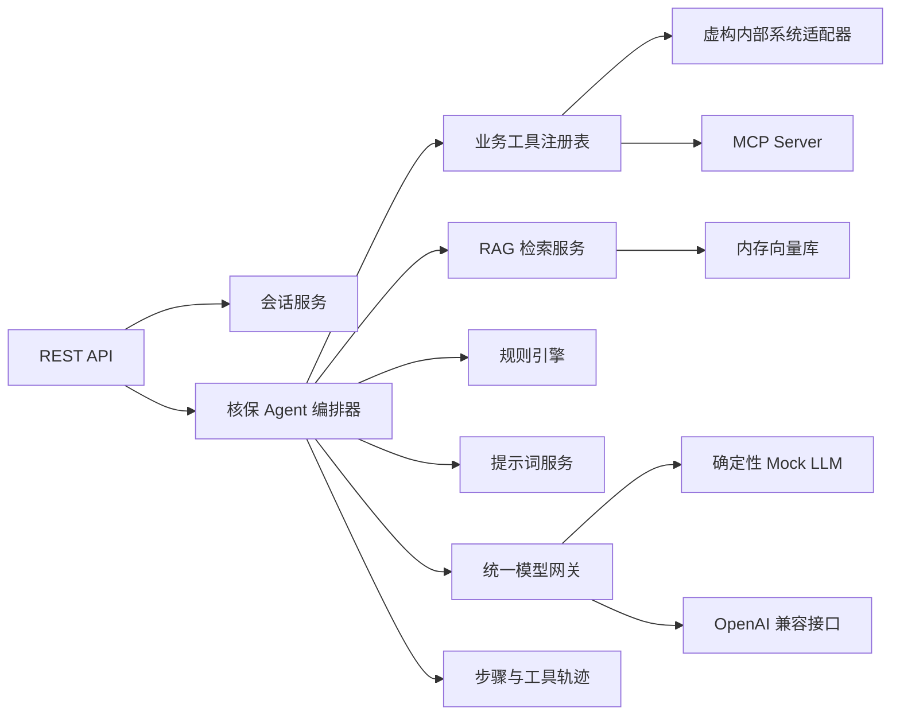

# 财险智能核保 Agent Demo 设计说明

- 日期：2026-07-13
- 状态：已获用户批准
- 项目目录：`/Users/bingbing/insurance-underwriting-agent-demo`
- 计划仓库：`https://github.com/hrniux/insurance-underwriting-agent-demo`

## 1. 背景与目标

本项目构建一个简单、可运行、可解释的 Java 财险智能核保 Agent 教学 Demo，用于熟悉智能核保后端的框架、模块边界和端到端流程，并用于面试演示。

Demo 覆盖以下闭环：

1. 理解用户问题并创建或恢复会话。
2. 调用保单、报价、历史核保、风险查勘、灾害风险和规则校验工具。
3. 从产品条款、核保规则、风险说明和历史案例知识库检索证据。
4. 执行确定性业务规则。
5. 渲染版本化提示词模板。
6. 通过统一模型网关生成核保建议。
7. 返回风险结论、原因、整改动作、引用证据和完整执行轨迹。

项目不包含任何真实保险公司名称、商标、客户信息或业务数据。所有保单、规则、查勘报告和灾害数据均为虚构样例。

## 2. 设计原则

- **开箱即用**：默认无需大模型 API Key，也无需数据库、Redis、消息队列或容器即可运行。
- **框架真实**：使用 Spring Boot、Spring AI 和真实 MCP Server，而不是仅以普通 REST 接口模拟 MCP。
- **职责清晰**：会话、编排、RAG、规则、模型、提示词和工具各自拥有明确边界。
- **结果可解释**：核保建议必须携带规则明细、知识证据、工具轨迹和模型信息。
- **便于替换**：内存实现和虚构适配器均位于接口之后，可替换为 Redis、PGVector、企业模型和真实内部系统。
- **业务规则优先**：LLM 负责理解、归纳和表达；硬性承保限制由确定性规则引擎控制。
- **面试友好**：代码规模受控，README 和面试指南能在五分钟内演示核心流程。

## 3. 技术选型

| 类别 | 选择 | 说明 |
|---|---|---|
| 语言 | Java 21 | 本机已安装，支持 records、sealed types 等现代语法 |
| 应用框架 | Spring Boot 4.1.0 | 当前稳定版本，提供 Web、Validation、Actuator 和配置管理 |
| AI/MCP | Spring AI 2.0.0 | 提供 MCP Server、工具注解和 AI 相关抽象 |
| 构建 | Maven | 单模块 Maven 工程，降低理解和启动成本 |
| Web | Spring MVC | REST API 与 MCP WebMVC Server 共用 Servlet 技术栈 |
| API 文档 | springdoc-openapi 3.0.3 | 支持 Spring Boot 4，提供 OpenAPI 与 Swagger UI |
| JSON | Jackson | Spring Boot 默认 JSON 序列化 |
| 容错 | Spring Retry | 为模型调用提供可配置重试策略 |
| 测试 | JUnit 5、AssertJ、Mockito、MockWebServer | 单元、集成和模型 HTTP 适配器测试 |
| 运行 | 本地 JVM、Docker | 本地默认启动，附 Dockerfile |

为保证离线演示稳定，RAG 默认使用本项目实现的确定性 Hash Embedding 和内存向量库。它们通过端口隔离，生产化时可替换为真实 Embedding Model 与 PGVector 等 Vector Store。

## 4. 总体架构

项目采用模块化单体和端口/适配器思想，不拆分微服务。



推荐包结构：

```text
com.hrniux.underwriting
├── api
│   ├── session
│   ├── evaluation
│   ├── knowledge
│   ├── prompt
│   └── tool
├── agent
│   ├── domain
│   ├── orchestration
│   └── trace
├── session
├── rag
│   ├── document
│   ├── splitter
│   ├── embedding
│   ├── vectorstore
│   └── retrieval
├── model
│   ├── gateway
│   ├── mock
│   ├── openai
│   └── resilience
├── prompt
├── rule
├── tool
│   ├── policy
│   ├── quotation
│   ├── history
│   ├── survey
│   ├── disaster
│   └── mcp
└── shared
    ├── config
    ├── error
    └── observability
```

## 5. 核心业务流程

### 5.1 请求

核保评估请求至少包含：

- `sessionId`：可选；为空时创建新会话。
- `policyNo`：必填，用于查询业务事实。
- `question`：必填，核保人员的问题。

### 5.2 编排步骤

`UnderwritingAgentOrchestrator` 依次执行：

1. `LOAD_SESSION`：创建或恢复会话并记录用户消息。
2. `COLLECT_FACTS`：调用保单、报价、历史核保、查勘和灾害工具。
3. `RETRIEVE_KNOWLEDGE`：构造检索查询，执行 Top-K 语义检索。
4. `VALIDATE_RULES`：运行确定性核保规则并计算风险分。
5. `RENDER_PROMPT`：渲染当前激活的提示词模板。
6. `CALL_MODEL`：通过统一模型网关生成结构化建议。
7. `FINALIZE`：合并规则底线、模型建议、证据和轨迹，保存评估结果。

每个步骤均记录：名称、状态、开始时间、结束时间、耗时和错误摘要。失败步骤不会伪装为成功。

### 5.3 输出

评估结果包含：

- `evaluationId`、`sessionId` 和 `policyNo`。
- `decision`：`APPROVE`、`MANUAL_REVIEW` 或 `REJECT`。
- `riskLevel`：`LOW`、`MEDIUM`、`HIGH` 或 `CRITICAL`。
- `riskScore`：0 至 100。
- `summary`、`reasons` 和 `requiredActions`。
- `evidence`：知识片段引用及相似度。
- `ruleResults`：每条命中规则及其影响。
- `toolTrace` 和 `stepTrace`。
- `model`：provider、model、尝试次数及是否降级。
- `elapsedMs`。

最终结论遵循确定性优先级：拒保硬规则可以把模型建议提升为 `REJECT`，人工复核规则可以把 `APPROVE` 提升为 `MANUAL_REVIEW`，模型不能绕过规则降低风险等级。

## 6. 会话管理

`SessionService` 负责：

- 创建会话并生成唯一 ID。
- 查询会话状态和消息历史。
- 追加 `USER`、`ASSISTANT` 和 `SYSTEM` 消息。
- 关联核保评估记录。
- 更新会话最后活动时间。

默认使用线程安全内存仓库。领域层仅依赖 `SessionRepository`，生产环境可替换为 Redis 或数据库。

## 7. RAG 知识库

### 7.1 文档类型

- `PRODUCT_CLAUSE`：产品条款。
- `UNDERWRITING_RULE`：核保规则。
- `RISK_GUIDE`：风险说明和风险减量建议。
- `HISTORICAL_CASE`：历史案例。

默认内置 Markdown 样例文档，覆盖企财险暴雨、洪水、火灾、仓储查勘及历史核保案例。

### 7.2 入库流水线

```text
原始文本
  -> 文档类型和元数据校验
  -> Markdown/Text 解析
  -> 按段落切分
  -> 最大字符窗口与重叠
  -> Hash Embedding
  -> L2 归一化
  -> 内存向量库
```

默认切分参数：最大 500 个字符、重叠 80 个字符；可通过配置修改。

Hash Embedding 将分词结果稳定映射到固定维度并进行 L2 归一化。它不是生产级语义模型，但可稳定展示“解析—切分—向量化—入库—相似度检索”全过程，并支持确定性测试。

### 7.3 检索

检索接口支持：

- `query`：查询文本。
- `topK`：默认 4。
- `documentType`：可选过滤。
- `productCode`：可选险种过滤。

结果按余弦相似度降序排列，并包含文档 ID、标题、类型、险种、片段、片段序号和分数。编排器把问题与业务事实组合为检索查询，避免只用原始问题导致召回上下文不足。

## 8. 提示词模板管理

提示词由 `PromptTemplateService` 管理，包含：

- 模板代码。
- 版本号。
- 模板正文。
- 所需变量集合。
- 是否为激活版本。
- 更新时间。

系统内置 `underwriting-analysis` 模板。管理接口支持列表、读取、创建新版本、激活版本和预览渲染。渲染前严格检查缺失变量，未识别变量不会静默忽略。

主要变量包括：`question`、`policyFacts`、`quotationFacts`、`historyFacts`、`surveyFacts`、`disasterFacts`、`ruleResults` 和 `knowledgeEvidence`。

## 9. 规则引擎

规则实现统一接口，并按优先级运行：

```java
interface UnderwritingRule {
    RuleResult evaluate(UnderwritingContext context);
}
```

默认规则：

1. 高灾害风险区域规则：红色灾害风险至少触发人工复核。
2. 历史高赔付规则：近三年多次赔付提高风险分。
3. 高保额规则：超过阈值触发人工复核。
4. 查勘整改未完成规则：关键整改未完成触发人工复核。
5. 禁止承保组合规则：关键消防缺陷与极高火灾风险同时存在时拒保。

每条结果包含规则代码、是否命中、严重度、分数影响、建议决策和可读原因。

## 10. 统一模型调用

模型端口：

```java
interface ModelGateway {
    ModelResponse generate(ModelRequest request);
}
```

实现包括：

- `DeterministicMockModelGateway`：默认启用，根据事实、规则和证据返回稳定的结构化结果。
- `OpenAiCompatibleModelGateway`：调用兼容 `/v1/chat/completions` 的模型服务。
- `RoutingModelGateway`：根据配置选择 provider。

OpenAI 兼容配置包括 base URL、API Key、模型名、连接超时、读取超时、最大尝试次数和退避时间。网络异常、HTTP 429 和 5xx 可以重试；请求校验失败与其他 4xx 不重试。

默认不进行静默降级。若显式开启 `fallback-to-mock`，响应必须标记 `fallbackUsed=true` 并保留原始错误代码。

日志和响应不得包含 API Key、Authorization Header 或完整敏感请求头。

## 11. Agent 工具与 MCP

六个业务能力同时注册为内部 Agent 工具和 MCP 工具：

| MCP 工具名 | 作用 |
|---|---|
| `get_policy` | 查询保单、标的、险种与保险期限 |
| `get_quotation` | 查询保额、费率、保费和免赔额 |
| `get_underwriting_history` | 查询历史核保和赔付摘要 |
| `get_survey_report` | 查询风险查勘和整改状态 |
| `get_disaster_risk` | 查询区域暴雨、洪水和火灾风险 |
| `validate_rules` | 执行确定性核保规则 |

工具方法使用 Spring AI `@McpTool` 和强类型参数，自动生成 JSON Schema。Spring AI WebMVC MCP Server 通过推荐的 Streamable HTTP 协议暴露工具发现和调用端点，配置为 `spring.ai.mcp.server.protocol=STREAMABLE`。REST 调试入口复用同一个工具注册表，避免 MCP 与 REST 各维护一份业务逻辑。

默认工具适配器读取虚构数据；缺少保单或数据时返回明确的领域错误。工具调用轨迹记录工具名、输入摘要、状态、耗时和输出摘要，不记录敏感字段。

## 12. REST API

```text
POST   /api/v1/sessions
GET    /api/v1/sessions/{sessionId}
POST   /api/v1/underwriting/evaluations
GET    /api/v1/underwriting/evaluations/{evaluationId}

POST   /api/v1/knowledge/documents
GET    /api/v1/knowledge/documents
POST   /api/v1/knowledge/search

GET    /api/v1/prompts
GET    /api/v1/prompts/{code}
POST   /api/v1/prompts/{code}/versions
POST   /api/v1/prompts/{code}/versions/{version}/activate
POST   /api/v1/prompts/{code}/preview

GET    /api/v1/tools
POST   /api/v1/tools/{toolName}/invoke

GET    /actuator/health
GET    /swagger-ui.html
```

所有请求使用 Jakarta Validation。错误响应使用 RFC 9457 Problem Details，至少包含 `type`、`title`、`status`、`detail`、`instance`、`errorCode`、`traceId` 和 `timestamp`。

## 13. 异常与降级策略

- 请求参数错误：HTTP 400，返回字段校验明细。
- 会话、评估、保单或提示词不存在：HTTP 404。
- 重复或状态冲突：HTTP 409。
- 模型超时或不可用：HTTP 503，错误码 `MODEL_UNAVAILABLE`。
- 工具不可用：记录失败轨迹；关键工具失败则停止评估，非关键外部风险工具失败则把决策下限提升为人工复核。
- RAG 无召回：继续规则核验，但在结果中标记证据不足并至少人工复核。
- 非预期异常：HTTP 500，不暴露堆栈和密钥。

## 14. 测试策略

### 14.1 单元测试

- 文档解析、切分边界和重叠窗口。
- Hash Embedding 的确定性、归一化和零向量处理。
- 余弦相似度、Top-K 排序和元数据过滤。
- 提示词缺失变量、版本创建和激活。
- 每条业务规则及规则优先级。
- 模型路由、超时、重试、不可重试 4xx 和显式降级。
- 工具注册和各虚构数据适配器。
- 编排器成功、证据不足、关键工具失败和模型失败路径。

### 14.2 集成测试

- REST API 请求校验和响应结构。
- 创建会话并完成一次端到端核保评估。
- 知识文档入库与检索。
- 提示词版本管理。
- MCP 工具注册、发现和调用。
- 应用在无 API Key 条件下启动。

### 14.3 运行验证

- `mvn test` 运行全部测试。
- `mvn verify` 运行构建验证。
- 启动 JAR 后检查 Actuator 健康状态。
- 使用演示脚本调用知识检索、工具和核保评估 API。
- 验证 Swagger UI 和 MCP 端点可访问。
- 使用 Docker 构建并运行一次健康检查。

## 15. 文档与演示交付物

- `README.md`：项目定位、架构、快速启动、配置和生产化演进。
- `docs/INTERVIEW_GUIDE.md`：五分钟演示脚本、模块讲解、常见追问和回答思路。
- `docs/API_EXAMPLES.md`：可复制的 curl 请求。
- `docs/ARCHITECTURE.md`：架构图、组件职责和时序图。
- `scripts/demo.sh`：启动后的端到端演示脚本。
- OpenAPI/Swagger UI。
- Dockerfile。
- 虚构业务数据和知识文档。

## 16. 明确不在范围内

- 用户登录、RBAC、OAuth2 和多租户。
- 真实保险公司内部系统连接。
- 真实客户或保单数据。
- Kafka、分布式事务和微服务拆分。
- 生产级 Embedding 模型或向量数据库部署。
- LLM 自动决定最终拒保且绕过确定性规则。
- 前端管理界面。

这些内容会在文档中作为生产化扩展方向说明，但不进入本次 Demo 实现。

## 17. 验收标准

1. 在 `/Users/bingbing/insurance-underwriting-agent-demo` 存在可构建的 Java 21 Maven 工程。
2. 无 LLM Key 时应用能启动并完成一次端到端核保评估。
3. 会话管理、任务编排、提示词版本管理均有 REST API 和自动化测试。
4. 知识文档能解析、切分、向量化、入库和 Top-K 检索，并返回证据引用。
5. 模型层支持 Mock 与 OpenAI 兼容 provider 切换，包含超时、异常分类和重试测试。
6. 六个内部业务能力均通过真实 MCP Server 注册，并能发现和调用。
7. 规则结果能够约束模型建议并生成结构化、可解释的核保结论。
8. `mvn test` 与 `mvn verify` 全部通过。
9. 本地 JAR 冒烟测试、演示脚本和 Docker 健康检查通过。
10. README、架构文档、API 示例和面试指南完整。
11. 代码提交并推送到 `hrniux/insurance-underwriting-agent-demo` 的 `main` 分支。
12. 本地 `HEAD`、`origin/main` 和 GitHub 远端 `refs/heads/main` 指向同一提交。

## 18. 仓库策略

- 默认创建公开 GitHub 仓库，方便简历和面试展示。
- 默认分支为 `main`。
- 远端使用 HTTPS，并复用本机 macOS Keychain 中的现有 Git 凭据。
- 提交信息采用简洁 Conventional Commits 风格。
- 推送前必须通过完整测试、运行验证和当前状态审查。
