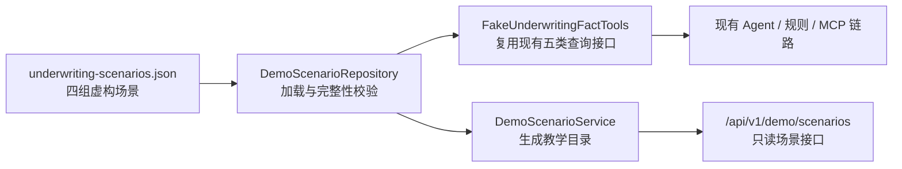

# 中文教学型核保演示优化设计

## 1. 文档目的

本文定义财险智能核保 Agent Demo 的第二轮学习体验优化方案。目标是在不改变现有 REST、MCP、Agent 编排、规则引擎和模型网关核心边界的前提下，通过结构化虚构数据、场景目录接口和统一中文文档，让第一次接触保险核保或本项目的读者能够沿着一条明确路径理解系统。

本设计只使用虚构公司、地址、保单、条款和风险数据，不包含真实客户或保险业务数据，也不构成真实核保建议。

## 2. 目标读者与成功标准

### 2.1 目标读者

- 不熟悉保险核保流程的 Java 学习者；
- 需要快速演示 Agent、RAG、规则引擎和 MCP 组合方式的面试候选人；
- 准备扩充 Demo 场景或替换内部系统适配器的开发者。

### 2.2 成功标准

完成后，读者应能在十分钟内完成以下任务：

1. 从 README 找到推荐学习顺序和虚构数据声明；
2. 通过场景目录了解四张示例保单的业务差异和预期结论；
3. 运行中文演示脚本，观察自动通过、人工复核、边界风险和拒保四种结果；
4. 根据字段字典理解保额、赔付、查勘整改和灾害等级；
5. 根据决策推导表说明“业务事实 → 命中规则 → 风险加分 → 最终决策”；
6. 修改一份 JSON 场景数据并理解它如何被业务工具加载；
7. 运行自动化测试确认数据、接口、规则结果和文档契约仍然一致。

## 3. 方案概览

系统新增一个只负责加载和展示演示场景的边界：



`DemoScenarioRepository` 是场景数据的唯一来源。现有 `FakeUnderwritingFactTools` 不再维护五组硬编码 `Map`，而是从仓库按保单号读取对应事实。场景目录接口读取同一份数据，因此页面、脚本、业务工具和文档不会出现相互独立的示例值。

## 4. 演示场景

| 保单号 | 中文场景 | 主要事实 | 规则命中 | 预期决策 | 预期风险 |
|---|---|---|---|---|---|
| `P-1001` | 临港高风险物流仓库 | 保额 2,000 万元、近三年出险 2 次、排水整改未完成、暴雨红色风险 | 红色暴雨、重复出险、高保额、整改未完成 | 人工复核（`MANUAL_REVIEW`） | 高（`HIGH`），70 分 |
| `P-2001` | 低风险科技办公楼 | 保额 500 万元、无历史出险、无待整改事项、灾害风险低 | 无 | 自动通过（`APPROVE`） | 低（`LOW`），10 分 |
| `P-3001` | 暴雨暴露商贸仓库 | 保额 1,200 万元、无重复出险、整改完成、暴雨红色风险 | 红色暴雨、高保额 | 人工复核（`MANUAL_REVIEW`） | 中（`MEDIUM`），40 分 |
| `P-4001` | 极端火灾风险制造厂房 | 保额 800 万元、消防设施重大缺陷、火灾风险极端、整改已完成 | 极端火灾叠加重大消防缺陷 | 拒保（`REJECT`） | 高（`HIGH`），60 分 |

四组场景分别回答“为什么通过”“为什么需要人工”“风险如何叠加”和“什么情况触发不可降低的拒保底线”。现有 `P-1001`、`P-2001` 的值与结论保持兼容。

## 5. 数据模型与加载规则

### 5.1 文件位置

场景数据保存在：

```text
src/main/resources/demo/underwriting-scenarios.json
```

使用 JSON 而不是 Java 初始化代码，原因是 JSON 对初学者更直观、能被 Jackson 直接读取、容易与接口响应对照，并且无需为 Demo 引入额外 YAML 解析依赖。

### 5.2 单个场景结构

每个场景包含：

- `policyNo`：唯一保单号；
- `name`：中文场景名称；
- `summary`：一句话教学说明；
- `question`：推荐提交给核保接口的问题；
- `learningPoints`：该场景用于解释的知识点；
- `expectedResult`：预期决策、风险等级、风险分和规则代码；
- `policy`：险种、投保人、标的用途、地址和保险期限；
- `quotation`：保额、费率、保费和免赔额，金额统一使用人民币元；
- `history`：近三年出险次数、赔付金额和历史核保结论；
- `survey`：消防状态、排水整改状态、未决问题和查勘结论；
- `disaster`：区域、暴雨、洪水、火灾风险等级和评估日期。

### 5.3 启动校验

应用启动加载时必须拒绝以下无效数据：

- 场景列表为空或保单号重复；
- 任一子对象缺失；
- 子对象保单号与场景保单号不一致；
- 保额、费率、保费、免赔额、赔付金额或出险次数为负数；
- 保险终期不晚于起期；
- 预期风险分不在 0–100；
- 预期规则代码重复。

配置文件不存在、无法解析或校验失败时，应用应在启动阶段明确失败，并在异常消息中指出资源路径或场景保单号。系统不得静默回退到另一份隐藏数据。

## 6. 场景目录接口

### 6.1 接口定义

新增两个只读接口：

```text
GET /api/v1/demo/scenarios
GET /api/v1/demo/scenarios/{policyNo}
```

列表接口返回按保单号排序的场景摘要；详情接口返回完整教学信息与五类业务事实。接口不触发核保评估、不创建会话、不写入数据。

### 6.2 中文友好响应

响应同时保留稳定的英文枚举值和中文显示值，例如：

```json
{
  "decision": "MANUAL_REVIEW",
  "decisionLabel": "人工复核",
  "riskLevel": "HIGH",
  "riskLevelLabel": "高风险",
  "riskScore": 70
}
```

金额字段继续以数字形式返回，另提供格式化中文展示值，例如 `sumInsuredDisplay: "2,000 万元"`。展示值只服务学习，不参与规则计算。

不存在的保单号复用项目现有 Problem Details 错误格式，返回 HTTP 404 和 `POLICY_NOT_FOUND`。

## 7. 中文文档规范

### 7.1 文档结构

新增 `docs/DEMO_DATA_GUIDE.md`，固定使用以下结构：

1. 文档目的；
2. 适用对象；
3. 十分钟学习路线；
4. 四组虚构场景总览；
5. 场景逐步推导；
6. 字段字典；
7. 中英文枚举对照；
8. 如何修改或新增场景；
9. 常见问题；
10. 虚构数据与非业务建议声明。

### 7.2 写作约定

- 标题、说明、脚本提示和示例问题使用简体中文；
- 类名、方法名、路径、命令、JSON 字段和 API 枚举保持原始英文；
- 专业枚举第一次出现时采用“中文名称（`ENUM_VALUE`）”；
- 金额同时说明业务单位和原始数值，例如“2,000 万元（`20000000` 元）”；
- 风险原因使用可验证的事实描述，避免“风险很高”等无证据表述；
- 每条操作步骤都给出预期结果；
- 所有场景显著标记为虚构数据。

README 增加“推荐学习路线”和新文档入口；API 示例补充场景接口；架构文档补充场景仓库组件；演示脚本的阶段标题和完成提示改为中文。

## 8. 演示脚本

`scripts/demo.sh` 保持一条命令运行，但调整为中文教学流程：

1. 检查服务健康；
2. 查询场景目录；
3. 执行一次 RAG 检索；
4. 调用共享业务工具；
5. 依次评估四组场景；
6. 输出场景名称、预期结论和实际完整 JSON；
7. 输出 Swagger、场景目录和 MCP 地址。

脚本继续使用 `curl` 与 `python3 -m json.tool`，不增加 `jq` 依赖。任一步 HTTP 调用失败时立即退出。

## 9. 测试策略

### 9.1 数据加载测试

- 能加载四组场景；
- 场景按保单号可查询；
- 重复保单号、负金额和保单号不一致会被拒绝；
- 未知保单号返回现有 `POLICY_NOT_FOUND`。

### 9.2 规则与业务工具测试

- 现有 `P-1001`、`P-2001` 断言保持通过；
- `P-3001` 为人工复核、中风险、40 分；
- `P-4001` 为拒保、高风险、60 分；
- 五类业务工具都从场景仓库返回一致的保单号。

### 9.3 API 集成测试

- 列表接口返回四组排序场景和中文标签；
- 详情接口返回教学信息与完整事实；
- 未知场景返回 404 Problem Details；
- 核保评估接口仍能评估四组场景。

### 9.4 文档契约测试

- README、架构、API 示例和教学指南均存在；
- 教学指南包含四个保单号、十分钟学习路线、字段字典和虚构数据声明；
- README 包含教学指南与场景接口入口；
- 演示脚本包含四组场景和中文步骤标题。

## 10. 兼容性与非目标

### 10.1 兼容性

- 不修改现有核保评估请求或响应结构；
- 不修改现有六个 REST/MCP 工具名称和参数；
- 不改变现有五条规则、风险分区间或决策优先级；
- 不改变默认离线 Mock 模型行为；
- `P-1001`、`P-2001` 保持原有事实和结论。

### 10.2 本轮非目标

- 不新增前端框架或可视化控制台；
- 不接入真实保险系统、数据库或外部模型；
- 不实现运行时修改演示数据的写接口；
- 不把中文显示值写入核心领域枚举；
- 不引入生产级配置中心或数据迁移机制。

## 11. 验收条件

本轮优化只有在以下证据全部成立后才算完成：

1. 四组场景由 JSON 文件加载，核心假数据类不再硬编码五组 `Map`；
2. 两个场景目录接口可用并有集成测试；
3. 四组场景的实际规则结论与本文预期一致；
4. 中文教学指南、README、架构和 API 示例互相链接且术语一致；
5. 演示脚本以中文步骤运行四组场景；
6. `mvn clean verify` 通过；
7. 本地启动后健康检查、场景目录和至少一次核保评估通过真实 HTTP 验证；
8. Git 工作区只包含本轮预期改动，没有覆盖用户已有内容。
